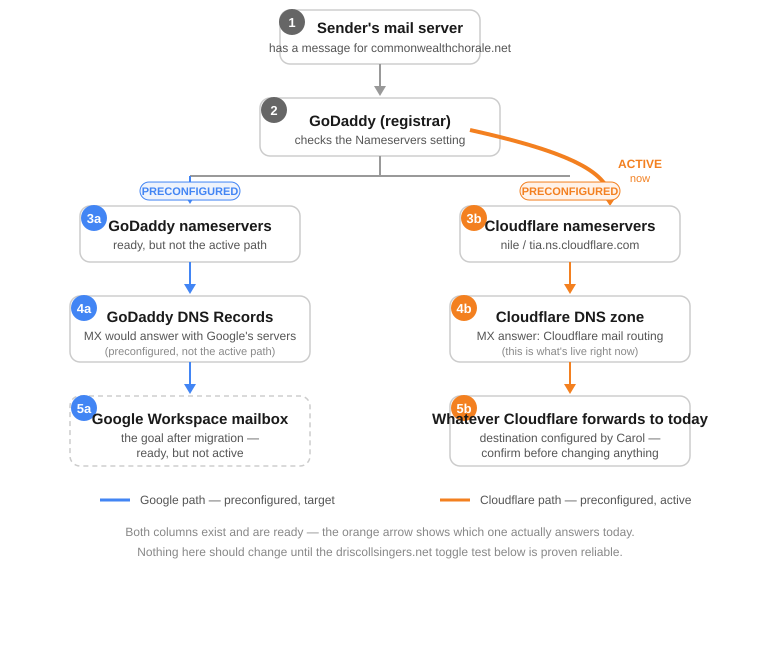
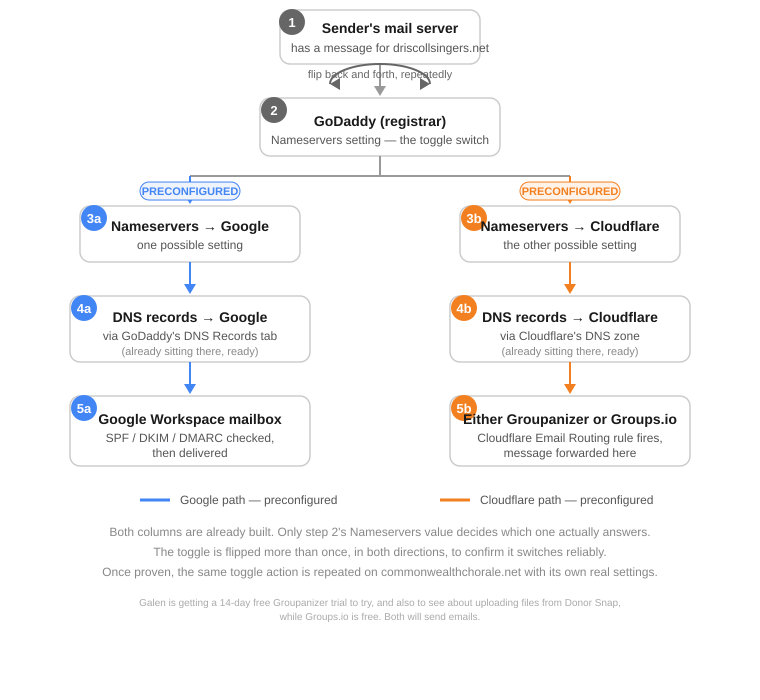

# What Actually Happens When Someone Emails driscollsingers.net

**(1)** An email is sent. A mail server — Gmail's, in this test — has a message addressed to `testsingers@driscollsingers.net` and needs to figure out where in the world to deliver it. It doesn't know yet; all it has is a domain name.

**(2)** That mail server asks the internet's DNS system a question: "who is authoritative for driscollsingers.net, and what's the mail server for that domain?" The first stop in answering that question is the domain's registry record — the piece of information that says, for driscollsingers.net, "ask these two nameservers." That registry record is exactly the **Nameservers** setting inside GoDaddy. GoDaddy is the registrar, which means GoDaddy is the party that gets to tell the wider internet which nameservers are authoritative for this domain. It doesn't matter who actually runs those nameservers — GoDaddy's job is just to point at them correctly.

From here, the path splits in two (steps 3 onward in the diagram), depending on what that Nameservers setting currently says. Each box in a column is named for where the message ends up, not for who's hosting the plumbing along the way — that's why every box on the left mentions Google, and every box on the right mentions Groupanizer, even though the actual DNS host differs from the final destination.

**Left column — if it says GoDaddy's own nameservers (3a):** the sending mail server goes and asks GoDaddy's DNS servers directly, "what's the MX record for driscollsingers.net?" **(4a)** GoDaddy's DNS servers answer with whatever records live in GoDaddy's own DNS Records tab — in this domain's case, Google's mail servers (`aspmx.l.google.com` and its alternates). **(5a)** The sending mail server then connects to Google's mail infrastructure and hands off the message. Google checks its own records (the SPF, DKIM, and DMARC entries also stored in that same DNS zone) to decide whether to trust the message, then delivers it into the Google Workspace mailbox for that address.

**Right column — if it says Cloudflare's nameservers (3b):** the sending mail server instead asks Cloudflare's DNS servers the same question. **(4b)** Cloudflare answers with its own MX records — its mail-routing servers, not Google's. **(5b)** The sending mail server connects to Cloudflare instead, and Cloudflare's Email Routing feature takes over: it looks up the routing rule set up for `testsingers@driscollsingers.net` and forwards the message on to **Groupanizer**, the destination configured for that address. Google is never contacted at all in this version — the message's entire journey happens through Cloudflare's infrastructure until it lands in Groupanizer.

Two details make this trickier to observe than it sounds. First, only one of these two columns is ever active for the domain as a whole — it's determined by that single Nameservers setting, not by the individual email address, so no domain can have some addresses going through Google and others going through Cloudflare at the same time. Second, DNS answers get cached for a period of time (the record's TTL) by every mail server and resolver that asks about them, so a sending mail server can still be holding onto a stale answer even right after the Nameservers setting changes — which is why a test can appear to succeed or fail for reasons that have nothing to do with whether the setting change actually "worked."

The only way to know which path a given message actually took is to look at where it ended up and read the delivery trail left in its headers — that trail records every mail server that actually touched the message, which is the ground truth regardless of what any dashboard currently displays.

---

## The same picture, applied to commonwealthchorale.net

Both columns for commonwealthchorale.net are marked preconfigured — the right column because it's genuinely built and running today, and the left column as the target structure this document has been walking through, ready to be built out the same way it already exists on the test domain. What distinguishes them here isn't which one is "real" — it's the orange arrow curving from GoDaddy (2) over to the right column (3b), marked **ACTIVE now**. That arrow is the actual current state: this domain's Nameservers setting points at Cloudflare, so the right column is the only one that resolves anything right now. A message sent to this domain goes through Cloudflare's DNS zone (4b) and lands at **Groupanizer** (5b). The left column (3a/4a/5a, the Google target) is drawn dashed at step 5a specifically because, while the pattern is understood, those records haven't actually been built on this domain yet.

Nothing about this domain should be touched until the toggle mechanism itself has been proven on the test domain below.

---

## The same picture, as the actual test plan for driscollsingers.net

Unlike the two diagrams above, the two columns here are **not** in the same state as each other. The left column (3a/4a/5a) is real, finished work — Google Workspace has been configured and tested on driscollsingers.net already, and mail is confirmed delivering through it today. The right column (3b/4b/5b) is not built yet. Nothing has been configured or tested on the Cloudflare side — no Email Routing rule, no confirmed delivery to Groupanizer or Groups.io. That column is drawn dashed for exactly that reason: it's the plan, not the current state.

The work ahead happens in two stages, in order:

1. **Build and test the right column on its own first**, independent of any toggling. That means setting up Cloudflare Email Routing for driscollsingers.net, deciding between Groupanizer and Groups.io as the destination (both are being evaluated — Galen is running a 14-day free Groupanizer trial, partly to check whether it can pull in files from Donor Snap, while Groups.io is being tried as the free alternative; both will send email regardless of which is chosen), and confirming with the header-trail method described above that mail genuinely reaches that destination through Cloudflare.

2. **Only once the right column works on its own** does the toggle test begin: flipping the Nameservers setting at step 2 back and forth — Google to Cloudflare, then Cloudflare back to Google — more than once, confirming each time which path actually carried the message. Successfully toggling back and forth is what proves the mechanism itself is reliable, not just that one side or the other happens to work.

The entire point of doing this on driscollsingers.net first is that a successful toggle test tells Galen exactly which settings — which "cells" in GoDaddy — need to change to carry out the same switch on commonwealthchorale.net, with confidence, using its own real records rather than test ones.
