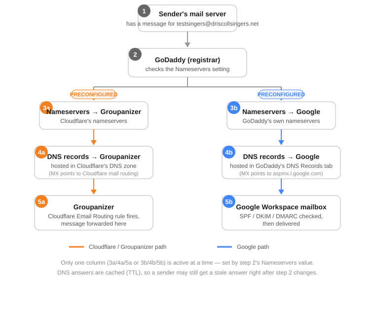

# What Actually Happens When Someone Emails driscollsingers.net

**(1)** An email is sent. A mail server — Gmail's, in this test — has a message addressed to `testsingers@driscollsingers.net` and needs to figure out where in the world to deliver it. It doesn't know yet; all it has is a domain name.

**(2)** That mail server asks the internet's DNS system a question: "who is authoritative for driscollsingers.net, and what's the mail server for that domain?" The first stop in answering that question is the domain's registry record — the piece of information that says, for driscollsingers.net, "ask these two nameservers." That registry record is exactly the **Nameservers** setting inside GoDaddy. GoDaddy is the registrar, which means GoDaddy is the party that gets to tell the wider internet which nameservers are authoritative for this domain. It doesn't matter who actually runs those nameservers — GoDaddy's job is just to point at them correctly.

From here, the path splits in two (steps 3 onward in the diagram), depending on what that Nameservers setting currently says.

**If it says GoDaddy's own nameservers (3a):** the sending mail server goes and asks GoDaddy's DNS servers directly, "what's the MX record for driscollsingers.net?" **(4a)** GoDaddy's DNS servers answer with whatever records live in GoDaddy's own DNS Records tab — in this domain's case, that answer is Google's mail servers (`aspmx.l.google.com` and its alternates). **(5a)** The sending mail server then connects to Google's mail infrastructure and hands off the message. Google checks its own records (the SPF, DKIM, and DMARC entries also stored in that same DNS zone) to decide whether to trust the message, then delivers it into the Google Workspace mailbox for that address.

**If it says Cloudflare's nameservers (3b):** the sending mail server instead asks Cloudflare's DNS servers the same question. **(4b)** Cloudflare answers with its own MX records — its mail-routing servers, not Google's. **(5b)** The sending mail server connects to Cloudflare instead, and Cloudflare's Email Routing feature takes over: it looks up the routing rule set up for `testsingers@driscollsingers.net` and forwards the message on to **Groupanizer**, the destination configured for that address. Google is never contacted at all in this version — the message's entire journey happens through Cloudflare's infrastructure until it lands in Groupanizer, the parallel to Google Workspace on this side of the diagram.

Two details make this trickier to observe than it sounds. First, only one of these two paths is ever active for the domain as a whole — it's determined by that single Nameservers setting, not by the individual email address, so no domain can have some addresses going through Google and others going through Cloudflare at the same time. Second, DNS answers get cached for a period of time (the record's TTL) by every mail server and resolver that asks about them, so a sending mail server can still be holding onto a stale answer even right after the Nameservers setting changes — which is why a test can appear to succeed or fail for reasons that have nothing to do with whether the setting change actually "worked."

The only way to know which path a given message actually took is to look at where it ended up and read the delivery trail left in its headers — that trail records every mail server that actually touched the message, which is the ground truth regardless of what any dashboard currently displays.
